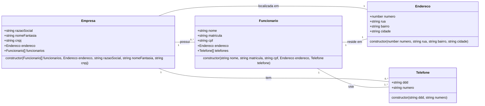

# RT1

## Desenvolva o código fonte, das classes, a partir do diagrama UML

Atenção aos atributos de cada classe e seus tipos.



## Faça o teu código funcionar!

```typescript
import Empresa from "./models/Empresa";
import Funcionario from "./models/Funcionario";
import Endereco from "./models/Endereco";
import Telefone from "./models/Telefone";

//Declaração das variáveis
let end = new Endereco(194, "Rua das Rosas", "Jardim Florestal", "Nova Horizonte");
let endEmp = new Endereco(675, "Avenida 13 de Março", "Jardim Industrial", "São Carlos");

let tel = new Telefone("(22)", "99764-4137");
let emp = new Funcionario("Pietra", "164749813", "764.419.481-84", endEmp, tel);

//Lista de funcionários
let funcionarios = [emp];

//Lista de telefones
let tel1 = new Telefone("(12)", "9944-3574");
let tel2 = new Telefone("(12)", "3349-8541");

let telefones = [tel1, tel2];

let company = new Empresa("Netflix Entretenimento Brasil LTDA", "Netflix", "13.590.585/0001", end, funcionarios);

console.log(company.descritor())
```

Crie um método para imprimir, no terminal, os atributos de uma empresa. Use o código como exemplo!

## Saída do console
    Razão Social: Netflix Entretenimento Brasil LTDA
    Nome Fantasia: Netflix
    CNPJ: 13.590.585/0001
    Endereço:
    Rua: Rua das Rosas, Bairro: Jardim Florestal, Cidade: Nova Horizonte, Número: 194

    Funcionários:
    Nome: Pietra
    Matrícula: 164749813
    CPF: 764.419.481-84
    Rua: Avenida 13 de Março, Bairro: Jardim Industrial, Cidade: São Carlos, Número: 675
